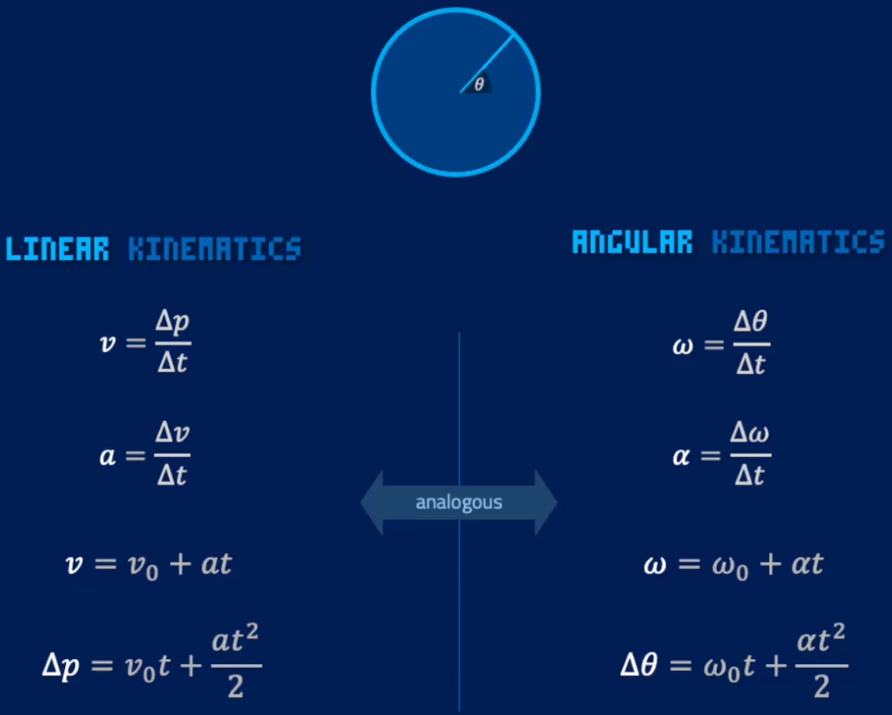

学习pikuma的课程：2D Game Physics Programming。

## Proof of Rotation Matrix


## Integration Method
Implicit Euler: Best for stiff systems due to unconditional stability, but requires solving a system of equations at each step.

Verlet Integration: Excellent for conserving energy and handling physical systems with constant or smoothly varying forces, but generally only second-order accurate.

Runge-Kutta Methods: Highly accurate and flexible, suitable for a wide range of problems, but can suffer from stability issues and require more computational effort per step.

## Drag Force
$$F_d = \frac{1}{2} \rho v^2 C_d A * -\hat{v}$$
ρ (rho) is the density of the fluid (kg/m³).

v is the velocity of the body relative to the fluid (m/s).

𝐶_𝑑 is the drag coefficient, which is a dimensionless number that depends on the shape of the body and the flow conditions.

A is the reference area of the body (m²), often the frontal area for objects moving through the air.

## Friction Force
### Static Friction
$$F_s \leq \mu_s N$$
Static friction acts on objects that are not moving relative to each other.
F_s is the static friction force.

μ_s is the coefficient of static friction, a dimensionless value that depends on the materials in contact.

N is the normal force, which is the perpendicular force exerted by a surface on an object (usually equal to the object's weight if the surface is horizontal).

The static friction force adjusts to match the applied force up to a maximum value. If the applied force exceeds this maximum, the object starts to move, and kinetic friction takes over.
### Kinetic Friction
$$F_k = \mu_k N$$

Kinetic friction acts on objects that are moving relative to each other. 

F_k is the kinetic friction force.

μ_k is the coefficient of kinetic friction, which is usually less than the coefficient of static friction.

N is the normal force.

## Newton's Law of Universal Gravitation
$$F_g = G \frac{m_1 m_2}{r^2}$$

## Spring Force
$$F_s = -k x$$

## Simulating Soft Body


Add spring force beteen 4 particles.

## Angular Velocity
$$\omega = \frac{d\theta}{dt}$$



## Torque Force
$$\tau = r F \sin(\theta)$$
Simplify it to
$$\tau = I \alpha$$
I is Moment of Inertia, which measures how much an object "resists" to change its angular acceleration.

https://en.wikipedia.org/wiki/List_of_moments_of_inertia

## Collision Detection
### Collision Contact Information


### Broad Phase and Narrow Phase
Collision detection is crucial in ensuring realistic interactions in simulations and games. The broad phase quickly culls non-colliding pairs, making the narrow phase, which involves detailed and computationally expensive checks, more efficient. Together, these phases ensure accurate and efficient collision detection.

### Collision Response
The collision normal is the direction in which the potential impulse should be applied.
The penetration depth (along with some other things) will determine how big of an impulse we need to use.

Projection Method

The Projection method, also known as the Position Correction method, involves directly adjusting the positions of colliding objects to resolve interpenetration. This method is typically used in conjunction with other collision resolution techniques to ensure that objects do not overlap.

$$\mathbf{MTV} = d \mathbf{n}$$
$$\Delta \mathbf{r}_1 = -\frac{m_2}{m_1 + m_2} \mathbf{MTV}$$
$$\Delta \mathbf{r}_2 = \frac{m_1}{m_1 + m_2} \mathbf{MTV}$$

Minimum Translation Vector(MTV).

n as the normal vector at the point of contact pointing from object 1 to object 2.

d as the penetration depth.

Impulse Method

The Impulse method resolves collisions by applying an instantaneous change in velocity (impulse) to the colliding objects, based on the laws of conservation of momentum and energy.

$$\mathbf{J} = -(1 + \epsilon) \frac{\mathbf{v}_r \cdot \mathbf{\hat{n}}}{\frac{1}{m_1} + \frac{1}{m_2}} $$

J is the impulse.

$\epsilon$ is the coefficient of restitution (0 for perfectly inelastic, 1 for perfectly elastic collisions).

v_r  is the relative velocity.

n is the collision normal.

m_1 and m_2 are the masses of the colliding objects.


Penalty Method

The Penalty method simulates collisions by applying a repulsive force proportional to the depth of penetration and possibly the relative velocity of the objects. This method treats interpenetration as a soft constraint.

$$\mathbf{F} = -k \mathbf{d} - b \mathbf{v}$$

F is the penalty force.

k is the stiffness constant (spring constant).

d is the penetration depth vector.

b is the damping coefficient.

v is the relative velocity.

#### Object with Infinite Mass
```cpp
bool Body::IsStatic() {
    float epsilon = 0.005f;
    return fabs(invMass - 0.0f) < epsilon;
}
```
#### Momentum
Elastic Collisions
$$m_1 v_{1,\text{initial}} + m_2 v_{2,\text{initial}} = m_1 v_{1,\text{final}} + m_2 v_{2,\text{final}}$$
$$\frac{1}{2} m_1 v_{1,\text{initial}}^2 + \frac{1}{2} m_2 v_{2,\text{initial}}^2 = \frac{1}{2} m_1 v_{1,\text{final}}^2 + \frac{1}{2} m_2 v_{2,\text{final}}^2$$
Inelastic Collisions
$$m_1 v_{1,\text{initial}} + m_2 v_{2,\text{initial}} = (m_1 + m_2) v_{\text{final}}$$

#### Linear Collision Response


Linear collision response focuses on updating the linear velocities of colliding bodies without considering rotational effects. This is a simplified scenario compared to full rigid body dynamics but is commonly used in many simulations where rotational effects are negligible.

### Axis-Aligned Bounding Box


### Separating Axis Theorem
The Separating Axis Theorem (SAT) is a fundamental concept in computational geometry, particularly useful in collision detection algorithms for convex shapes. The theorem states that two convex shapes are not intersecting if and only if there exists a line (axis) along which the projections of the two shapes do not overlap.


点到edge normal的投影，就是点到edge的垂直距离。


当y轴指向上方时，normal的计算是顺时针旋转。但是SDL的坐标系，y轴正方向指向下方，此时normal就是逆时针旋转90度。

所以a的normal是指向a外边的，如果b有一点在a内部，那么dot product就是负数。


### Linear and Angular Impulse


$\omega$ is perpendicular to 2D screen.

cross($\omega$, r) = cross(Vec3(0, 0, $\omega$), Vec3(rx, ry, 0)) = Vec3(0*0-$\omega$*ry, $\omega$\*rx-0\*0, 0)


